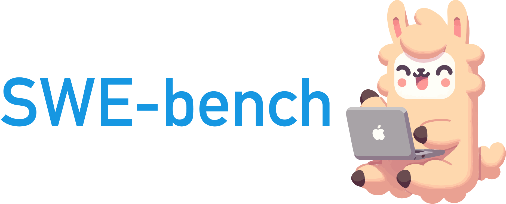

<p align="center">
  <a href="https://github.com/princeton-nlp/Llamao">
    
  </a>
</p>

# SWE-bench Website

This repository contains the code for the website and leaderboard of the SWE-bench project.

To learn more about SWE-bench, please check out the main code [repository]() along with the main paper, [SWE-bench: Can Language Models Resolve Real-world Github Issues?]().

If you found SWE-bench helpful for your work, please cite as follows:
```
@inproceedings{jimenez2023swebench,
  title = {SWE-bench: Can Language Models Resolve Real-World GitHub Issues?},
  author = {Jimenez, Carlos E. and Yang, John and Wettig, Alexander and Yao, Shunyu and Pei, Kexin and Press, Ofir and Narasimhan, Karthik},
  booktitle = {ArXiv},
  year = {2023},
}
```

Our sincere thanks to Prof. Pranav Rajpurkar and the creators of the [SQuAD](https://rajpurkar.github.io/SQuAD-explorer/) dataset for allowing us to use their website template.
